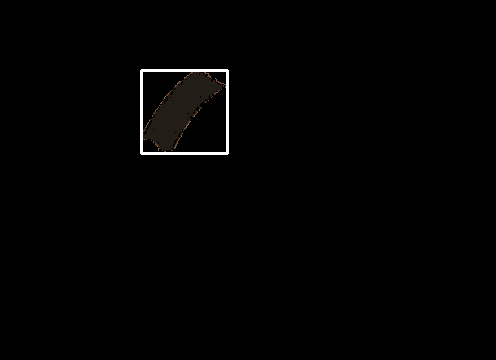

# Resistance Calculator using Colour Detection and Mask RCNN

This is an app that uses an implementation of [Mask R-CNN](https://arxiv.org/abs/1703.06870) that is updated to tensorflow 2 compatible by [leekunhee](https://github.com/leekunhee/Mask_RCNN/tree/master) and various colour detection techniques. The idea of calculating the resistance of a resistor using computer vision is to first isolate the resistor using image segmentation. We have tried out different methods of image segmentation. E.g. Canny Edge Algorithm, Watershed Algorithm. 

# Mask R-CNN
Trained a model using COCO weights to detect resistors of various kinds. The training process is adapted from [balloon.py](samples/balloon/balloon.py) and the detection process is adapted from [demo.ipynb](samples/demo.ipynb).

### Segmenting Resistors

### Cropping out to get the isolated resistor

# Colour Detection
After extracting the resistor and padding the background with black, making colour detection of resistor bands more accurate, we now perform colour detection. To increase accuracy, we quantize the image using [scikit's implementation of K means algorithm](https://scikit-learn.org/stable/auto_examples/cluster/plot_color_quantization.html#:~:text=Performs%20a%20pixel%2Dwise%20Vector,preserving%20the%20overall%20appearance%20quality.). The range of the number of colours that works best for us is around 12 to 16. 

### Colour Quantization

For now, the colour detection is not able to detect all 4 colour bands reliably. 

## Requirements
Python 3.8.5, TensorFlow 2.5, Keras 2.0.8 and other common packages listed in `requirements.txt`.

## Bibliography
Waleed Abdulla.Mask R-CNN for object detection and instance segmenta-tion on Keras and TensorFlow.https://github.com/matterport/Mask_RCNN. 2017