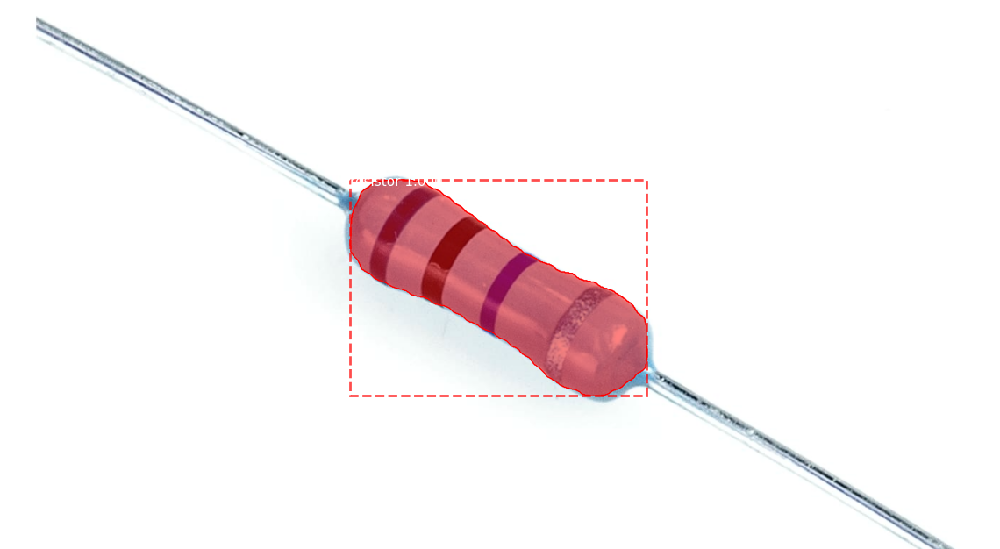
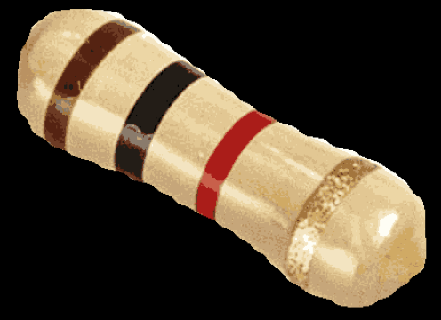
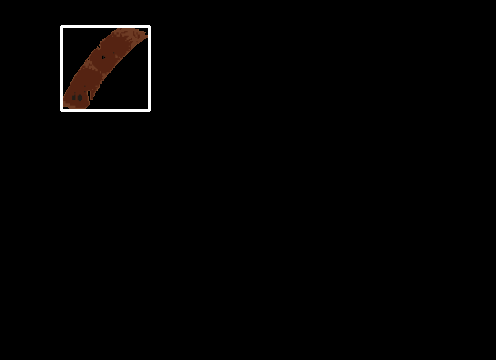
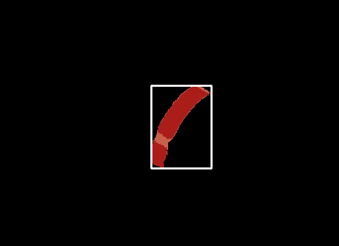
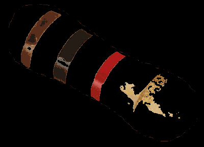
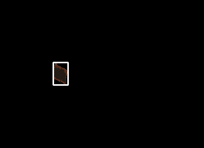
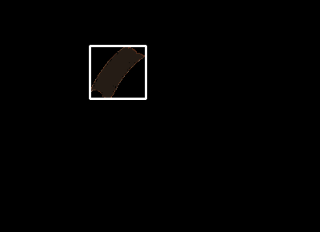
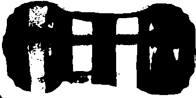
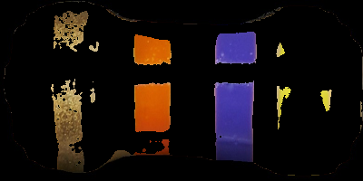
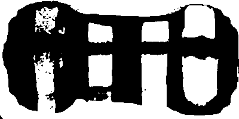

# Resistance Calculator using Colour Detection and Mask RCNN

This is an app that uses an implementation of [Mask R-CNN](https://arxiv.org/abs/1703.06870) that is updated to tensorflow 2 compatible by [leekunhee](https://github.com/leekunhee/Mask_RCNN/tree/master) and various colour detection techniques. The idea of calculating the resistance of a resistor using computer vision is to first isolate the resistor using image segmentation. We have tried out different methods of image segmentation. E.g. Canny Edge Algorithm, Watershed Algorithm. 

# Detection Process
The process of getting the resistance is the following:
* Isolate the resistor image using image segmentation models like Mask R-CNN. Another method of isolating the resistor is using an object detection algorithm like openCV's Cascade Classifier.
* Filter away the background by taking the average colour of the top and bottom row of the image and the resistor's body colour using bilateral filter and adaptive thresholding.
* Identify the colour bands using HSV boundaries of each colour of the band and save their coordinates, if the boxes overlaps and are the same colour, keep only one of them
* Assuming the order is correct (from left to right), calculate the resistance using according to the [resistor colour code table](https://eepower.com/resistor-guide/resistor-standards-and-codes/resistor-color-code/#)

# Mask R-CNN
Trained a model using COCO weights to detect resistors of various kinds. The training process is adapted from [balloon.py](samples/balloon/balloon.py) and the detection process is adapted from [demo.ipynb](samples/demo.ipynb).

### Segmenting Resistors

### Cropping out to get the isolated resistor

# Colour Detection
After extracting the resistor and padding the background with black, which makes colour detection of resistor bands more accurate, we now perform colour detection. To increase accuracy, we quantize the image using [opencv's implementation of K means algorithm](https://docs.opencv.org/3.4/d1/d5c/tutorial_py_kmeans_opencv.html). The range of the number of colours that works best for us is around 64 but this also depends on the lighting. Sometimes quantizing reduces the accuracy of the detections.

 For each hsv boundaries (colour boundaries), we create masks for each and find contours with areas that exceed some threshold and save the bounding box coordinates of that countour and its corresponding colour. The results will be the colour bands. However, this requires the resistors to be placed horizontally and the order of bands to be correct. For example, the first band is at the left.

### Colour Quantization

Another method we've tried is to convert the image to gray scale, then use adaptiveThreshold to filter out the background and the body of the resistor.

### Mask when using adaptiveThreshold

Gold still cannot be detected.

These two contours are combined as one as the difference in x-coordinates is close enough for it to be the same band.

### Resistor with Yellow Band and Bleach coloured body

But for some resistors, yellow is quite close to the colour of the body of the resistor. And the resulting threshold mask excludes the yellow.

### Initial Mask

### After Applying Mask

To include the yellow band, we've added the yellow mask into the initial mask to get a mask that includes the yellow band.

### Second Mask

### After Applying Mask

# Requirements
Python 3.8.5, TensorFlow 2.5, Keras 2.0.8 and other common packages listed in `requirements.txt`.

# Bibliography
Waleed Abdulla.Mask R-CNN for object detection and instance segmenta-tion on Keras and TensorFlow.https://github.com/matterport/Mask_RCNN. 2017