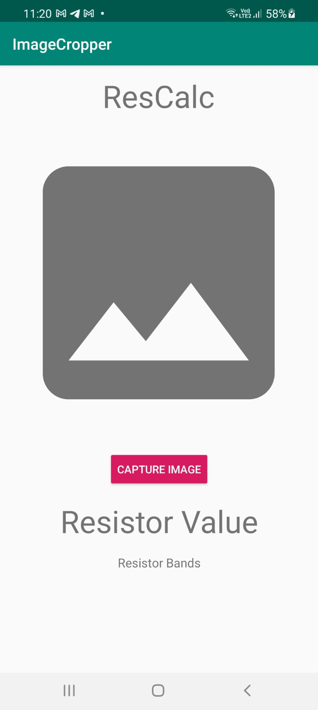
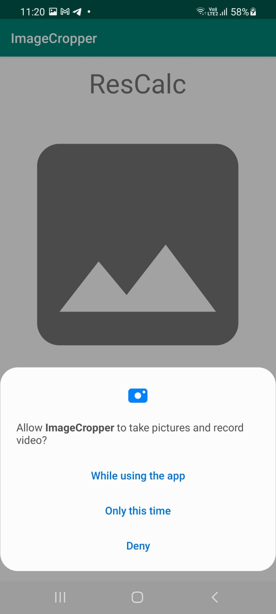
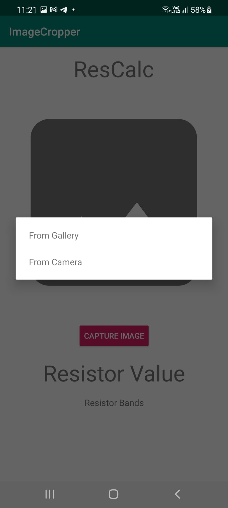
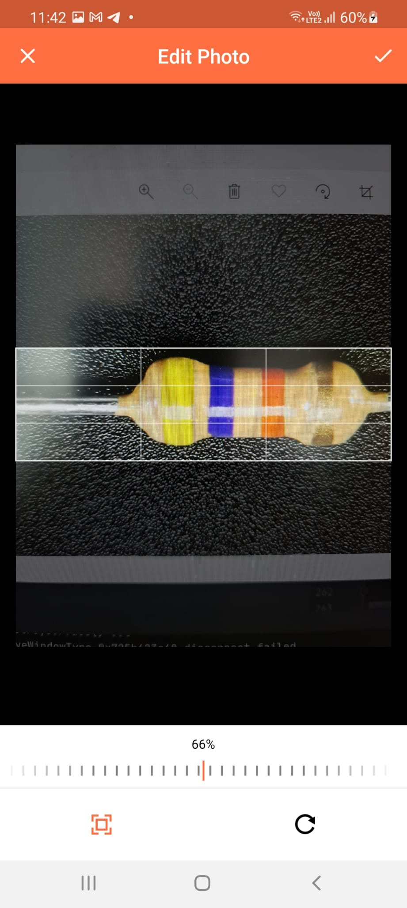
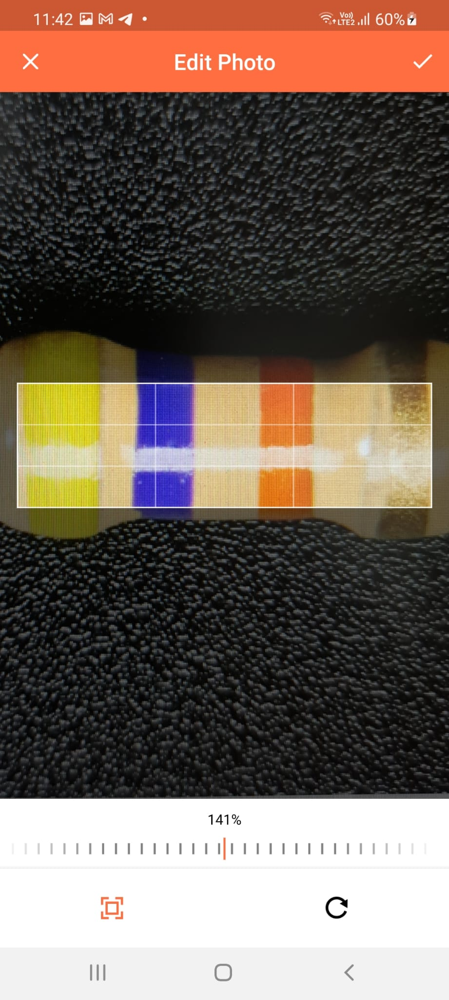
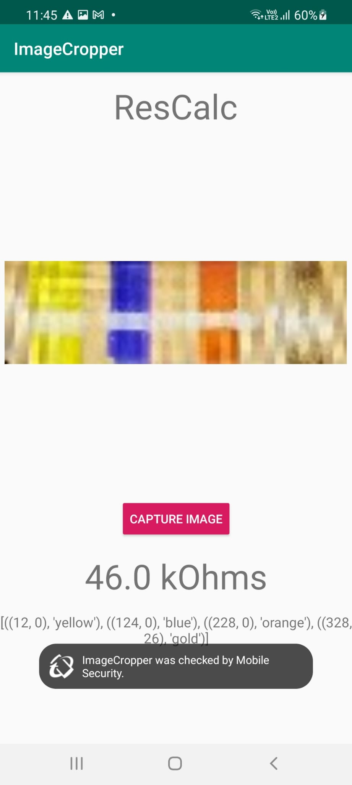
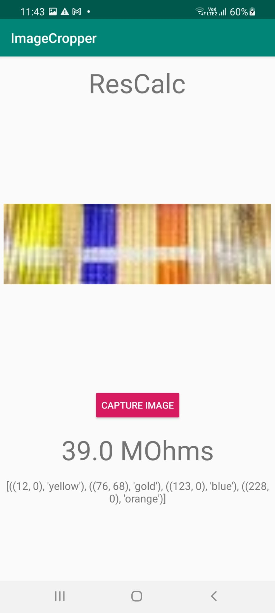
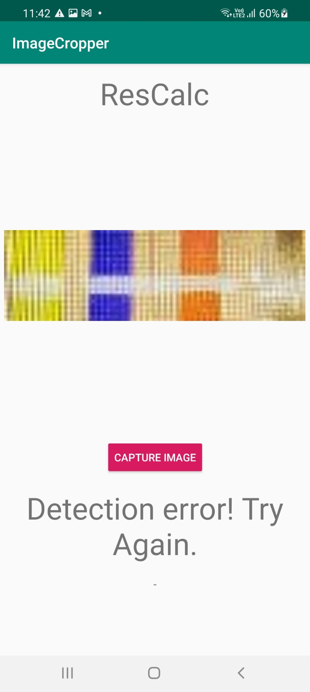

# Android app

This is an implementation of an android app tutorial that takes a picture and displays it in the app, with the camera function code done by Atif Pervaiz on youtube(https://www.youtube.com/watch?v=LpL9akTG4hI). This app uses Chaquopy, a method of using python in android studio as a starting point to insert the python code to detect the colours of the resistor bands into the app(https://chaquo.com/chaquopy/). The python code is taken from the mrcnntf2 branch with some edits to make it commpatible in android studio. The app language is java. 

This is updated version of the app. The original app can be found in the androidapp branch of the repository. This updated version does away with the mask-RCNN object detection method due to the intense load it places on the app. Instead, users will crop the image to find the resistor for the app to process. Through this method, app size has decreased significantly to over 120mb and processing time has also dropped dramatically from up to 2 minutes to up to 2 seconds. The downside is of course it sacrifices usability and some efficacy.

The image crop library is taken from https://github.com/Yalantis/uCrop.

# Notes

1. The app is still in its testing stage. Thus the app may crash occasionally. 
2. The app is actually not in its most optimised state due to the use of Chaquopy. App may be able to be reduced in size further once code is converted to java. Furthermore, conversion of python file to .pyc format may be possible now due to the previous issue of incompatible python version with the Chaquopy tensorflow library is no longer present. This may mean further downsizing of the app.
3. This app is using a free  and approved unlicensed version of Chaquopy. As stated in the commpany's website, the app will only work for 5 minutes from the point of activation of the app. Users will thus have to force stop the app in their phone settings to reactivate the app for further use.
4. Python code within this branch may or may not be up to date with the mrcnntf2 branch.

# Requirements

Android Studio and an android device is required. At least 120mb of space on your mobile device.

# Instructions

Download the zip file and extract the files inside. Open in Android Studio. Change the python path in the gradle file. Run on android device.

# App front page

# App request of permissions

# App choice of image

# App cropping UI

# Cropped image

# App result page (correct identification)

# App result page (wrong identification)

# App result page (when there is error)

