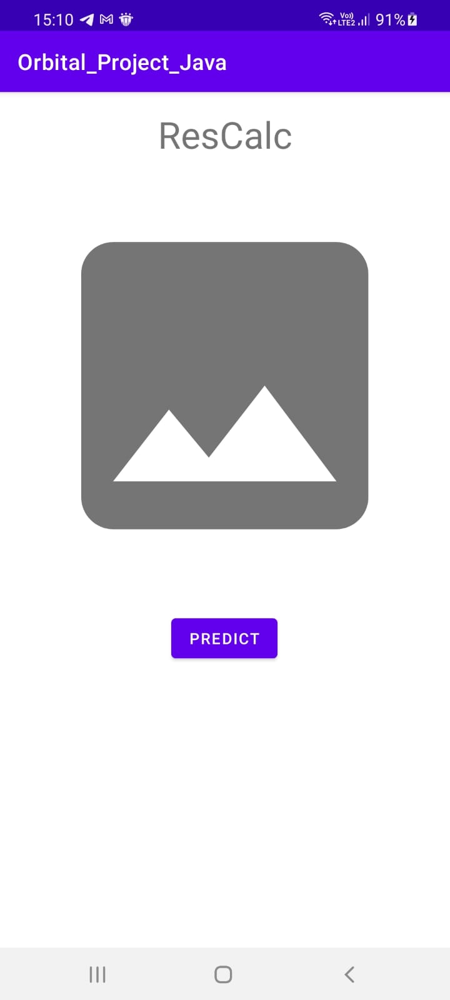
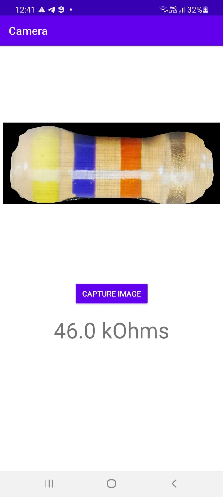
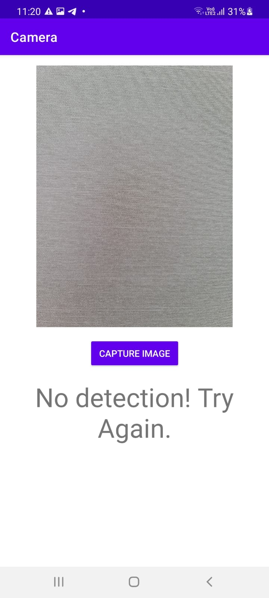

# Android app

This is an implementation of an android app tutorial that takes a picture and displays it in the app, with the camera function code done by Atif Pervaiz on youtube(https://www.youtube.com/watch?v=LpL9akTG4hI). This app uses Chaquopy, a method of using python in android studio as a starting point to insert the python code to detect the colours of the resistor bands into the app(https://chaquo.com/chaquopy/). The python code is taken from the mrcnntf2 branch with some edits to make it commpatible in android studio. The app language is java. 

# Notes

1. There is supposed to be a h5 weights file called mask_rcnn_resistor_044.h5 in folder app\src\mian\python but is not there due to github file transfer limit. Files in python depend on this file to run.
2. The app is still in its testing stage. Thus the app may crash occasionally. 
3. The app is currently in its most bloated state, both in terms of size and processing time. Newer updates will aim to improve the app in these two areas.
4. This app is using a free  and approved unlicensed version of Chaquopy. As stated in the commpany's website, the app will only work for 5 minutes from the point of activation of the app. Users will thus have to force stop the app in their phone settings to reactivate the app for further use.
5. Python code within this branch may or may not be up to date with the mrcnntf2 branch.

# Requirements

Android Studio and an android device is required. At least 2Gb of space on your mobile device.

# Instructions

Clone this repo and open in Android Studio. Run on android device.

# App front page

# App result page (correct identification)

# App result page (when there is error)

