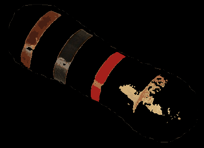

# Resistance Calculator using Colour Detection and Mask RCNN

This is an app that uses an implementation of [Mask R-CNN](https://arxiv.org/abs/1703.06870) that is updated to tensorflow 2 compatible by [leekunhee](https://github.com/leekunhee/Mask_RCNN/tree/master) and various colour detection techniques. The idea of calculating the resistance of a resistor using computer vision is to first isolate the resistor using image segmentation. We have tried out different methods of image segmentation. E.g. Canny Edge Algorithm, Watershed Algorithm. 

# Detection Process
The process of getting the resistance is the following:
### Identifying and Extracting Resistor
Isolate the resistor image using image segmentation models like Mask R-CNN. Another method of isolating the resistor is using an object detection algorithm like openCV's Cascade Classifier.
### Colour Quantization & White Balancing (Optional)
Quantize the image to reduce the number of colours that are used to represent the colour bands. White Balancing adjusts the image to render neutral colours correctly. Results vary. The white balancing algorithm we are using is taken from [here](https://github.com/mahmoudnafifi/WB_sRGB).
### Body Colour Filtering
Filter away the background by taking the average colour of the top and bottom row of the image and the resistor's body colour using bilateral filter and adaptive thresholding.
### Colour Detection
Identify the colour bands using HSV boundaries of each colour of the band and save their coordinates, if the boxes overlap and are the same colour, keep only one of them
### Resistance Calculation
Assuming the order is correct (from left to right), calculate the resistance using according to the [resistor colour code table](https://eepower.com/resistor-guide/resistor-standards-and-codes/resistor-color-code/#)

# Mask R-CNN
Trained a model using COCO weights to detect resistors of various kinds. The training process is adapted from [balloon.py](samples/balloon/balloon.py) and the detection process is adapted from [demo.ipynb](samples/demo.ipynb).

### Segmenting Resistors

### Cropping out to get the isolated resistor

# Colour Detection
After extracting the resistor and padding the background with black, which makes colour detection of resistor bands more accurate, we now perform colour detection. To increase accuracy, we quantize the image using [opencv's implementation of K means algorithm](https://docs.opencv.org/3.4/d1/d5c/tutorial_py_kmeans_opencv.html). The range of the number of colours that works best for us is around 64 but this also depends on the lighting. Sometimes quantizing reduces the accuracy of the detections.

For each hsv boundary (colour boundaries), we create masks for each boundary and find contours with areas that exceed some threshold and save the bounding box coordinates of that contour and its corresponding colour. The results will be the colour bands. For starters, we assume that we are only dealing with resistors that only have 5% or 10% tolerance which means that the last band will always be either gold or silver. From that we can get the order of colours by comparing the coordinates of the bounding boxes. To extend it into a general resistor with different tolerance levels, we will have to assume for now that the orientation of the resistor is correct. That is, the algorithm will read and calculate the colour bands in the same way as how one would read off a resistor in real life, from left to right.

### Colour Quantization

Another method we've tried is to convert the image to gray scale, then use adaptiveThreshold to filter out the background and the body of the resistor. This usually only works on resistors with body colour that is lighter coloured than the colour bands, like the resistors used in the examples.

### Mask when using adaptiveThreshold

Gold still cannot be detected.

The algorithm misdetected orange.

Our resolution to the problem of detecting multiple colours for the same band is comparing the areas of the contours that occupy similar positions and take the one with the larger area. In this case, the area of the bounding box for gold is greater than orange so orange is discarded.

Result:
Number of colour bands detected: 4
Sorted Position and Colours: [((50, 21), 'brown', 4692), ((118, 65), 'black', 2856), ((186, 101), 'red', 3904), ((251, 155), 'gold', 4092)]
Resistance: 1.00 kOhms LB: 950.00 Ohms UB: 1.05 kOhms

### Resistor with Yellow Band and Bleach coloured body

But for some resistors, yellow is quite close to the colour of the body of the resistor. And the resulting threshold mask excludes the yellow.

### Initial Mask

### After Applying Mask

To include the yellow band, we've added the yellow mask into the initial mask to get a mask that includes the yellow band.

### Second Mask

### After Applying Mask

# Requirements
Python 3.8.5, TensorFlow 2.5, Keras 2.0.8 and other common packages listed in `requirements.txt`.

# Bibliography
Waleed Abdulla.Mask R-CNN for object detection and instance segmenta-tion on Keras and TensorFlow.https://github.com/matterport/Mask_RCNN. 2017
